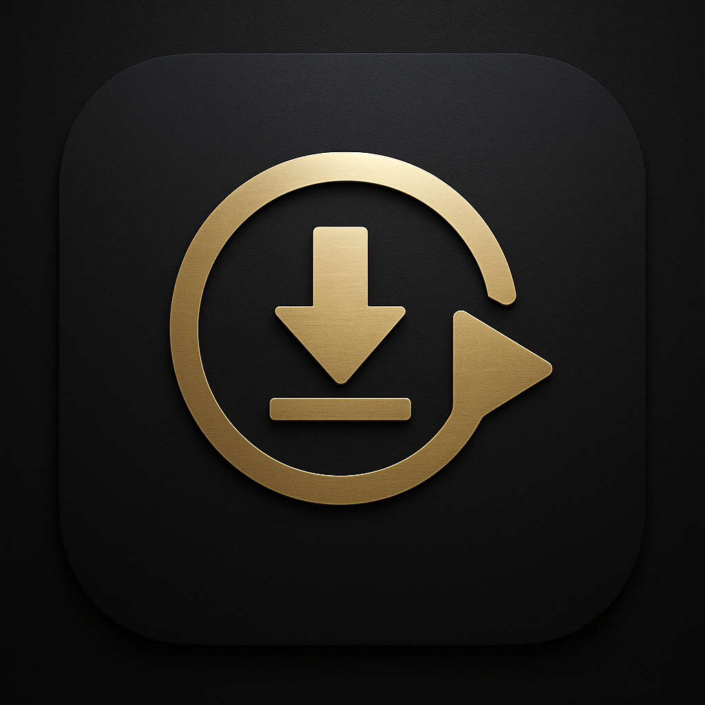
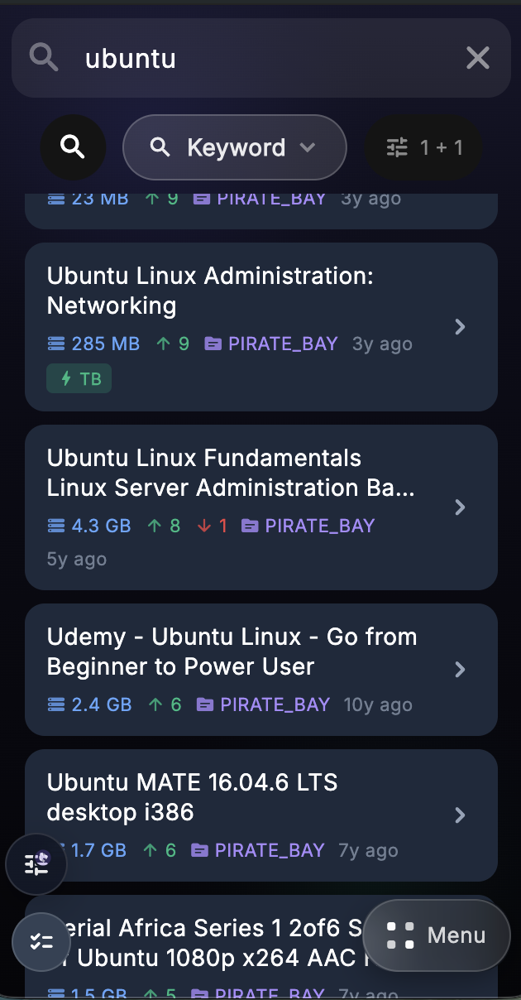
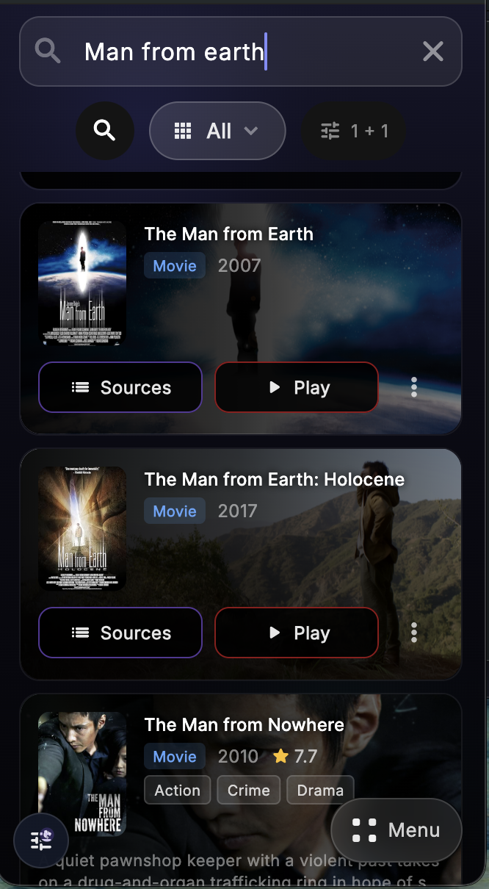
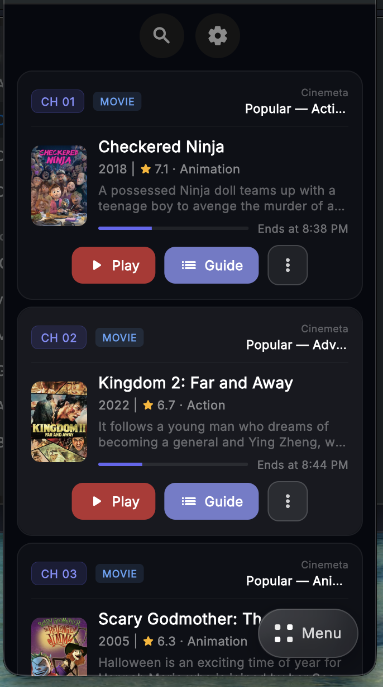
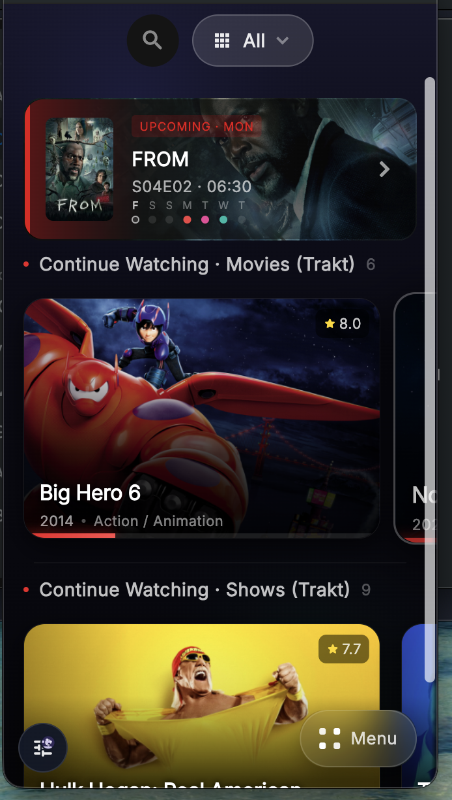
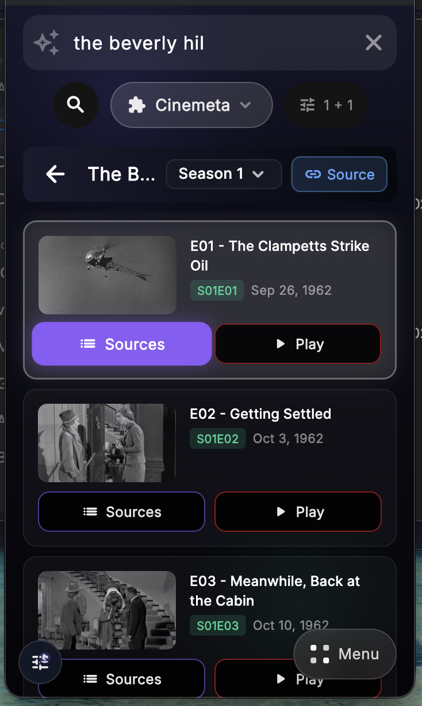
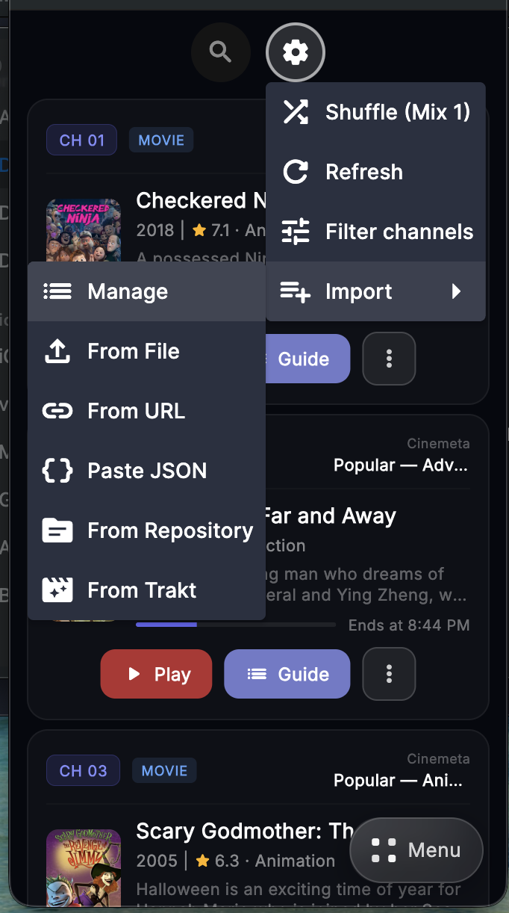

<p align="center">
  
</p>

<h1 align="center">Debrify</h1>

<p align="center">
  <strong>Stream & Download — Effortlessly</strong><br>
  The all-in-one media manager for debrid accounts, WebDAV libraries, and search sources
</p>

<p align="center">
  <a href="https://github.com/varunsalian/debrify/releases"></a>
  <a href="https://github.com/varunsalian/debrify/stargazers"></a>
  <a href="https://github.com/varunsalian/debrify/releases"></a>
  
  
</p>

<p align="center">
  <a href="https://varunsalian.github.io/debrify/"><strong>Website</strong></a> &bull;
  <a href="https://varunsalian.github.io/debrify/guides/index.html"><strong>Guides</strong></a> &bull;
  <a href="https://ko-fi.com/debrify"><strong>Support</strong></a> &bull;
  <a href="https://github.com/varunsalian/debrify/releases"><strong>Download</strong></a> &bull;
  <a href="#-features">Features</a> &bull;
  <a href="#-supported-platforms">Platforms</a> &bull;
  <a href="https://www.reddit.com/r/debrify/">Reddit</a> &bull;
  <a href="https://discord.gg/xuAc4Q2c9G">Discord</a>
</p>

---

<p align="center">
  
  
</p>
<p align="center">
  
  
</p>
<p align="center">
  
  
</p>

<p align="center">
  
  
  
  
  
  
</p>

<p align="center">
  <a href="https://ko-fi.com/debrify"></a>
  <a href="https://paypal.me/varunprojects"></a>
</p>

---

## What is Debrify?

Debrify is a **media manager** that lets you browse, stream, and download content from your debrid accounts and WebDAV servers—all from one app. It comes with a **built-in video player** optimized for movies and TV shows, a **download manager** with queue support, an **optional plugin system** for torrent search engines, **Jackett/Prowlarr indexer support**, **Trakt integration** for sync and discovery, and **Stremio Addons support** for discovering content.

Need help using a feature? Browse the user guides on GitHub Pages: [Debrify Guides](https://varunsalian.github.io/debrify/guides/index.html)

If Debrify has been useful to you, you can support development here:
- [Ko-fi](https://ko-fi.com/debrify)
- [PayPal](https://paypal.me/varunprojects)

---

## ✨ Features

<table>
<tr>
<td width="50%">

### Debrid Management
- **Multi-provider support** — Real-Debrid, Torbox, and PikPak
- **Full feature parity** — Stream, download, and manage files across all providers
- **Account dashboard** — View status, expiration, and usage at a glance
- **File browser** — Browse and manage your debrid cloud storage

</td>
<td width="50%">

### Built-in Player
- **Native playback** — Powered by media_kit/libmpv
- **Track selection** — Switch audio and subtitle tracks on the fly
- **Resume playback** — Picks up where you left off, always
- **TV-optimized** — Gesture controls on mobile, remote-friendly on TV

</td>
</tr>
<tr>
<td width="50%">

### Download Manager
- **Background downloads** — Queue files and let them download
- **Pause & resume** — Full control over your download queue
- **Batch operations** — Select multiple files, download all at once
- **Cross-platform** — Works on mobile and desktop

</td>
<td width="50%">

### Search Plugins *(Optional)*
- **Engine marketplace** — Import community-built torrent search engines
- **Multi-engine search** — Query multiple sources simultaneously
- **Jackett & Prowlarr** — Connect your own indexer managers and use them from the same source picker
- **Smart filtering** — Filter by quality, size, seeders, and more
- **One-click add** — Send results directly to your debrid provider
- **Build your own** — Follow the [custom engine guide](docs/engines/creating-custom-engines.md)

</td>
</tr>
<tr>
<td width="50%">

### Stremio Addons
- **Easy install** — Paste addon links or install directly from browser
- **Content discovery** — Search movies and shows across multiple sources
- **Quick play** — Stream directly or browse available torrents
- **Seamless integration** — Works with your debrid provider

</td>
<td width="50%">

### Stremio TV
- **TV guide experience** — Addon catalogs as live TV channels
- **Auto-rotation** — "Now playing" rotates on a configurable schedule
- **Channel filters** — Filter by addon or content type
- **Favorites** — Pin channels to home screen
- **Catalog importer** — Bring in JSON catalogs from files, URLs, repos, or Trakt lists (with one-tap refresh)
- **Build your own** — Follow the [Stremio catalog guide](docs/stremio/building-local-catalogs.md)

</td>
</tr>
<tr>
<td width="50%">

### Debrify TV
- **Keyword-driven channels** — Combine keyword recipes with Real-Debrid, Torbox, and PikPak engines to auto-build always-on channels
- **Quick Play & auto-launch** — Instant channel playback with random starts, resume buttons, and optional auto-launch overlay
- **Smart caching & rotation** — Caches torrents per channel and rotates movies/series so the lineup stays fresh all day
- **Import/Export** — ZIP/YAML packs, community collections, and remote-control export keep channels in sync across devices

</td>
<td width="50%">

### Trakt Integration
- **In-player scrobbling** — Debrify's video player reports start/pause/stop heartbeats to Trakt so your progress stays in sync everywhere
- **Now playing card** — Home screen tile mirrors your live Trakt scrobble and gives you a one-tap resume button
- **Upcoming calendar** — Dedicated Trakt calendar screen highlights the next episodes on your schedule with quick playback/mark-watched actions

</td>
</tr>
<tr>
<td width="50%">

### IPTV Support
- **M3U playlists** — Load your IPTV playlists
- **Live TV** — Watch live channels seamlessly
- **Channel favorites** — Organize and quick-access your channels

</td>
<td width="50%">

### External Players
- **Player choice** — Use your preferred video player app
- **VR support** — Stream to DeoVR for immersive playback
- **One-tap handoff** — Send any stream to external apps

</td>
</tr>
<tr>
<td width="50%">

### Reddit Videos
- **Audio merged** — Plays videos with audio properly combined
- **Download support** — Save Reddit videos locally

</td>
<td width="50%">

### WebDAV support
- **Connect your server** — Browse personal WebDAV storage directly inside Debrify
- **Stream with auth** — Play WebDAV files through the built-in player with credentials handled by the app
- **Playlist support** — Add individual files or folders to playlists and resume them later
- **Download support** — Save WebDAV files locally through the download manager

</td>
</tr>
<tr>
<td width="50%">

### Indexer Managers
- **Jackett support** — Search Jackett Torznab endpoints directly from torrent search
- **Prowlarr support** — Search Prowlarr indexers with API-key based configuration
- **Per-source controls** — Enable, disable, and limit each connected manager like other search sources

</td>
<td width="50%">

</td>
</tr>
</table>

---

## 📺 Android TV

A dedicated lean-back experience for your living room.

- **Remote-friendly player** — Full playback controls with D-pad navigation
- **Subtitle customization** — Size, style, color, and background options
- **Channel mode** — Watch content like cable TV with channel numbers
- **Quick channel guide** — Switch channels on the fly

---

## 📱 Supported Platforms

Debrify runs everywhere. One codebase, full feature support across all platforms.

| Platform | Download | Notes |
|:---------|:---------|:------|
| **Android** | [APK](https://github.com/varunsalian/debrify/releases) | Phones and tablets |
| **Android TV** | [APK](https://github.com/varunsalian/debrify/releases) | Full D-pad navigation and remote support |
| **Windows** | [Installer](https://github.com/varunsalian/debrify/releases) | Windows 10/11 |
| **macOS** | [DMG](https://github.com/varunsalian/debrify/releases) | Intel and Apple Silicon |
| **Linux** | [AppImage](https://github.com/varunsalian/debrify/releases) | x86_64 and ARM64. Requires dependencies ([see install notes](#linux)) |
| **iOS** | [IPA](https://github.com/varunsalian/debrify/releases) | Unsigned — requires sideloading ([guide](docs/iOS-Installation.md)) |

---

## 🚀 Installation

### Android / Android TV
Download the APK from [Releases](https://github.com/varunsalian/debrify/releases) and install. On TV, use a file manager app like Downloader or install via ADB.

### Windows
Download the installer, run it, and launch from the Start Menu. First run may trigger SmartScreen—click "More info" → "Run anyway".

### macOS
Download the DMG, drag Debrify to Applications. First launch: right-click → Open (app is not notarized).

### Linux
```bash
# Install dependencies (required)
# Ubuntu 24.04+
sudo apt install libmpv2 libsqlite3-dev libfuse2

# Ubuntu 22.04 / Debian
sudo apt install libmpv1 libsqlite3-dev libfuse2

# Fedora
sudo dnf install mpv-libs sqlite-devel fuse-libs

# Arch
sudo pacman -S mpv sqlite fuse2

# Run the AppImage
chmod +x debrify-*.AppImage
./debrify-*.AppImage
```

### iOS
Download the unsigned IPA and sideload using **AltStore** or **Sideloadly**. See the [iOS Installation Guide](docs/iOS-Installation.md) for step-by-step instructions.

> **Note:** Sideloaded apps require re-signing every 7 days. AltStore can handle this automatically.

---

## 🔌 Provider Support

| Feature | Real-Debrid | Torbox | PikPak |
|:--------|:-----------:|:------:|:------:|
| Stream files | ✅ | ✅ | ✅ |
| Download files | ✅ | ✅ | ✅ |
| Browse cloud storage | ✅ | ✅ | ✅ |
| Add magnets/links | ✅ | ✅ | ✅ |
| Playlists | ✅ | ✅ | ✅ |
| Episode tracking | ✅ | ✅ | ✅ |

---

## ❤️ Support Debrify

If the app has been useful to you and you want to help fund development:

- [Support on Ko-fi](https://ko-fi.com/debrify)
- [Support via PayPal](https://paypal.me/varunprojects)

Every bit helps keep the app improving.

---

## 🛠️ Building from Source

```bash
git clone https://github.com/varunsalian/debrify.git
cd debrify
flutter pub get
flutter run
```

**Build commands:**
```bash
flutter build apk --release              # Android
flutter build ios --release --no-codesign # iOS (unsigned)
flutter build windows --release          # Windows
flutter build macos --release            # macOS
flutter build linux --release            # Linux
```

---

## 🤝 Contributing

1. Fork the repo
2. Create a feature branch: `git checkout -b feature/my-feature`
3. Commit changes: `git commit -am 'Add my feature'`
4. Push: `git push origin feature/my-feature`
5. Open a pull request

---

## 💬 Community

- **Reddit** — [r/debrify](https://www.reddit.com/r/debrify/) for discussion and tips
- **Discord** — [Join the server](https://discord.gg/xuAc4Q2c9G) for help and updates
- **Issues** — [Report bugs](https://github.com/varunsalian/debrify/issues) or request features

---

## 📄 License

Debrify is released under the [Polyform Noncommercial License 1.0.0](LICENSE). Free for personal use. Commercial use is not permitted.

---

<p align="center">
  <a href="https://varunsalian.github.io/debrify/">
    
  </a>
</p>

<p align="center">
  <sub>Made with Flutter. Free for personal use.</sub>
</p>
