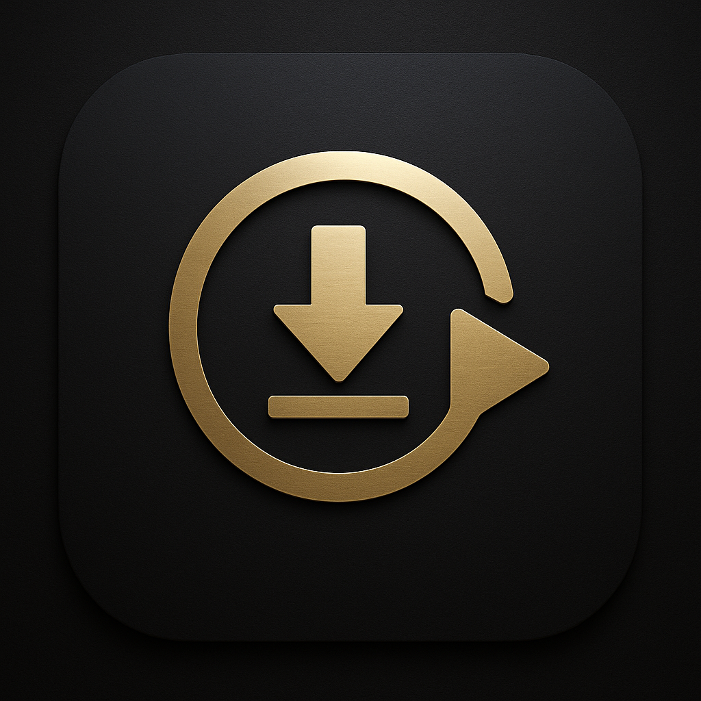

<p align="center">
  
</p>

<h1 align="center">Debrify</h1>

<p align="center">
  <strong>Your personal media hub</strong><br>
  One app to browse, stream, and organize media from your own services — with a cinematic player built in
</p>

<p align="center">
  <a href="https://github.com/varunsalian/debrify/releases"></a>
  <a href="https://github.com/varunsalian/debrify/stargazers"></a>
  <a href="https://github.com/varunsalian/debrify/releases"></a>
  
  
</p>

<p align="center">
  <a href="https://varunsalian.github.io/debrify/"><strong>Website</strong></a> &bull;
  <a href="https://github.com/varunsalian/debrify/releases"><strong>Download</strong></a> &bull;
  <a href="#-features">Features</a> &bull;
  <a href="#-supported-platforms">Platforms</a> &bull;
  <a href="https://www.reddit.com/r/debrify/">Reddit</a> &bull;
  <a href="https://discord.gg/xuAc4Q2c9G">Discord</a>
</p>

---

## What is Debrify?

Debrify is an open-source, cross-platform **media hub**. It brings the services you already use — cloud storage accounts, personal WebDAV servers, IPTV playlists, Stremio addon catalogs, YouTube — into one place, with a **built-in player** tuned for movies and TV, a **download manager**, **Trakt/Simkl/MDBList tracking**, and a **cinematic UI** that works just as well on a phone, a desktop, or a TV with a remote.

You connect your own accounts and sources. Debrify gives them one library, one player, and one interface everywhere.

## Responsible Use

Debrify does not host, sell, provide, or bundle media content. Search sources, addons, indexers, WebDAV servers, IPTV playlists, and cloud accounts are user-configured integrations. Only use Debrify with content, services, and sources that you own, created, licensed, or are otherwise authorized to access.

Third-party plugins, addons, indexers, playlists, and services are controlled by their respective providers or users. Debrify does not endorse using any integration to infringe copyright or violate a provider's terms. Do not submit or distribute configurations intended to facilitate unauthorized access to copyrighted content.

For more detail, see [Content Responsibility](https://varunsalian.github.io/debrify/content-responsibility.html).

---

## ✨ Features

### 🎬 Built-in Player
A native player (media_kit/libmpv) designed for long-form viewing:
- Audio and subtitle track switching on the fly
- Subtitle search, autoload, styling, and a real-time sync slider
- Resume playback — picks up where you left off, even across sources and devices
- Episode guides, next-episode navigation, sleep timer, playback speed
- Gesture controls on mobile; fully remote-driven on TV

### ☁️ Your Cloud Services
Connect the storage and streaming-cache accounts you already pay for — Real-Debrid, Torbox, Premiumize, PikPak, and AllDebrid are all supported with full parity:
- Stream or download any file in your account
- Browse and manage your cloud library
- Account dashboard with status, expiration, and usage
- Playlists and episode tracking across every provider

### 🏠 Personal Servers
- **WebDAV** — browse your own server, stream with credentials handled by the app, build playlists, download locally
- **Remote Setup** — securely send your full configuration between your own devices
- **Backup & Restore** — export everything to a single file, restore anywhere

### 🔎 Discovery & Catalogs
- **Stremio addons** — install addon catalogs, search across them, and play through your connected accounts
- **Catalog browsing** — poster grids, detail pages with ratings and Parents Guide, Watch Next recommendations
- **Quick Play** — long-press any poster to go straight into playback
- **Optional search plugins** — bring your own sources, including self-hosted Jackett and Prowlarr indexers

### 📡 Live & Lean-Back TV
- **IPTV** — M3U and Xtream playlists with an EPG guide, catchup, DVR recording, favorites, categories, and playlists that scale to tens of thousands of channels
- **Stremio TV** — browse catalogs as live channels with a cinematic tuner
- **Debrify TV** — build your own always-on channels from keyword recipes and your connected accounts

### 📈 Tracking
- **Trakt** — in-player scrobbling, a live Now Playing card, continue-watching rails, and an upcoming-episodes calendar
- **Simkl and MDBList** — sync progress and lists across services; local-only tracking works fully offline

### ⬇️ Download Manager
- Background queue with pause/resume and batch operations
- Save from any connected source — cloud accounts, WebDAV, YouTube
- Works on mobile and desktop, with scoped-folder support on Android

### ▶️ YouTube
- On-device search, no account or proxy required
- Resolution picker, endless scroll, downloads, and proper audio muxing into the built-in player

### 🔌 External Players
- Hand any stream to your preferred player app, including DeoVR for VR playback

---

## 📺 Android TV & Apple TV

A dedicated lean-back experience for the living room:

- **Cinematic UI** — poster grids, detail screens, and episode guides designed for big screens and low-end hardware
- **Remote-first** — full D-pad navigation everywhere, including an in-app keyboard with voice input
- **Quick Play** — long-press any card to start watching immediately
- **Subtitle tools** — search, offset sync, and full styling from the couch
- **Channel surfing** — IPTV EPG, quick guide, and instant zapping

---

## 📱 Supported Platforms

One codebase, full feature support across all platforms.

| Platform | Download | Notes |
|:---------|:---------|:------|
| **Android** | [APK](https://github.com/varunsalian/debrify/releases) | Phones and tablets |
| **Android TV** | [APK](https://github.com/varunsalian/debrify/releases) | Full D-pad navigation and remote support |
| **Windows** | [Installer](https://github.com/varunsalian/debrify/releases) | Windows 10/11 |
| **macOS** | [DMG](https://github.com/varunsalian/debrify/releases) | Intel and Apple Silicon |
| **Linux** | [AppImage](https://github.com/varunsalian/debrify/releases) | x86_64 and ARM64. Requires dependencies ([see install notes](#linux)) |
| **iOS** | [IPA](https://github.com/varunsalian/debrify/releases) | Unsigned — requires sideloading ([guide](docs/iOS-Installation.md)) |
| **Apple TV** | [IPA](https://github.com/varunsalian/debrify/releases) | Unsigned tvOS build — requires sideloading; ships with alpha releases |

---

## 🚀 Installation

### Android / Android TV
Download the APK from [Releases](https://github.com/varunsalian/debrify/releases) and install. On TV, use a file manager app like Downloader or install via ADB.

### Windows
Download the installer, run it, and launch from the Start Menu. First run may trigger SmartScreen — click "More info" → "Run anyway".

### macOS
Download the DMG, drag Debrify to Applications. First launch: right-click → Open (app is not notarized).

### Linux
```bash
# Install dependencies (required)
# Ubuntu 24.04+
sudo apt install libmpv2 libsqlite3-dev libfuse2

# Ubuntu 22.04 / Debian
sudo apt install libmpv1 libsqlite3-dev libfuse2

# Fedora
sudo dnf install mpv-libs sqlite-devel fuse-libs

# Arch
sudo pacman -S mpv sqlite fuse2

# Run the AppImage
chmod +x debrify-*.AppImage
./debrify-*.AppImage
```

### iOS
Download the unsigned IPA and sideload using **AltStore** or **Sideloadly**. See the [iOS Installation Guide](docs/iOS-Installation.md) for step-by-step instructions.

> **Note:** Sideloaded apps require re-signing every 7 days. AltStore can handle this automatically.

---

## ❤️ Support Debrify

Debrify is free, open source, and built by one person. If it has been useful to you, you can help fund development:

- [Support on Ko-fi](https://ko-fi.com/debrify)

Every bit helps keep the app improving.

---

## Before You Read the Code

A warning: this is not a clean codebase.

Debrify grew rapidly around features rather than a planned architecture. It contains enormous files, god classes, static state, duplicated provider logic, tightly coupled UI and business logic, inconsistent abstractions, legacy implementations, and more special cases than anyone should be proud of.

Some newer subsystems are better structured and heavily tested, but the repository as a whole does not represent Flutter best practices. It represents a product that kept growing while architectural cleanup repeatedly lost to the next feature or platform problem.

The application works and solves difficult problems, but maintaining it can be painful. Refactoring, simplification, and removal of legacy code are welcome.

## 🛠️ Building from Source

```bash
git clone https://github.com/varunsalian/debrify.git
cd debrify
flutter pub get
flutter run
```

**Build commands:**
```bash
flutter build apk --release              # Android
flutter build ios --release --no-codesign # iOS (unsigned)
flutter build windows --release          # Windows
flutter build macos --release            # macOS
flutter build linux --release            # Linux
```

---

## 🤝 Contributing

1. Fork the repo
2. Create a feature branch: `git checkout -b feature/my-feature`
3. Commit changes: `git commit -am 'Add my feature'`
4. Push: `git push origin feature/my-feature`
5. Open a pull request

---

## 💬 Community

- **Reddit** — [r/debrify](https://www.reddit.com/r/debrify/) for discussion and tips
- **Discord** — [Join the server](https://discord.gg/xuAc4Q2c9G) for help and updates
- **Issues** — [Report bugs](https://github.com/varunsalian/debrify/issues) or request features

---

## 📄 License

Debrify is released under the [Polyform Noncommercial License 1.0.0](LICENSE). Free for personal use. Commercial use is not permitted.

---

<p align="center">
  <a href="https://varunsalian.github.io/debrify/">
    
  </a>
</p>

<p align="center">
  <sub>Made with Flutter. Free for personal use.</sub>
</p>
